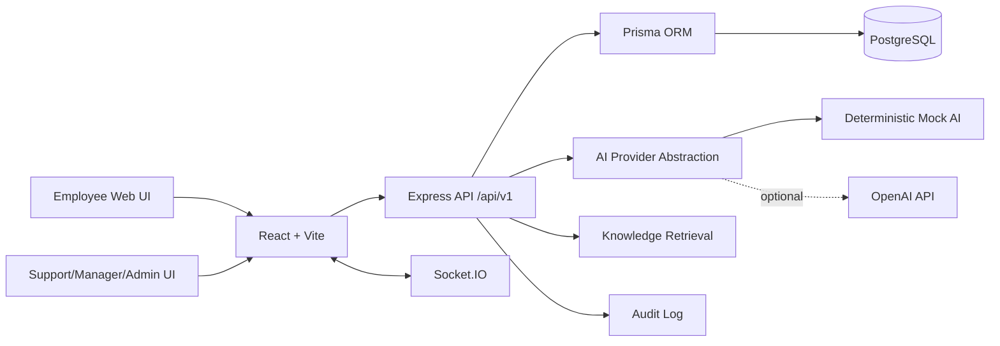

# OpsPilot

OpsPilot is an AI-assisted internal operations and support platform for companies. Employees can submit IT, HR, finance, security, facilities, and operations requests. Support teams can triage tickets, review AI recommendations, approve responses, monitor SLA health, and keep management analytics up to date.

The project is built as a portfolio-quality full-stack TypeScript monorepo. It is designed to show engineering judgment, tenant isolation, role-based access control, practical AI guardrails, and a polished enterprise SaaS interface.

## Business Problem

Internal support teams often work across disconnected inboxes, spreadsheets, chat threads, and knowledge documents. This makes it difficult to track ownership, detect repeated incidents, enforce SLA rules, and produce reliable operational reports.

OpsPilot centralizes that workflow. It creates a ticket, generates an AI summary, recommends category, priority, and department, searches the knowledge base, finds similar tickets, and drafts a response. Human support agents remain in control: AI suggestions must be approved or edited before they affect employees.

## Features

- Employee ticket creation and personal ticket tracking
- Support queue for assigned and unassigned tickets
- Available, assigned-to-me, and organization-wide ticket queue views
- Race-safe ticket claiming with visible requester, owner, and assignment history
- Ticket detail page with conversation, metadata, SLA state, AI panel, related tickets, sources, and status history
- JWT access tokens and rotating refresh tokens
- bcrypt password hashing
- Organization-level tenant isolation
- Role-based authorization for employees, support agents, managers, and administrators
- PostgreSQL schema managed with Prisma ORM
- Mock AI provider that works without `OPENAI_API_KEY`
- Optional OpenAI provider when an API key is configured
- Keyword-based knowledge retrieval with source references
- Similar-ticket detection for repeated incidents
- SLA policies by priority
- Management analytics dashboard
- Notifications persisted in the database
- Audit logging for sensitive actions
- Swagger/OpenAPI endpoint at `/api-docs`
- Docker and Docker Compose setup
- GitHub Actions CI workflow
- Unit tests and a Playwright VPN demo workflow

## Screenshots

Add screenshots after running the app locally:

- Login page
- Employee create-ticket flow
- Ticket detail with AI recommendation panel
- Support queue
- Analytics dashboard

## Architecture



## Technology Stack

- TypeScript throughout
- React with Vite
- Tailwind CSS
- Node.js with Express
- PostgreSQL
- Prisma ORM
- JWT access and refresh authentication
- bcrypt
- Zod request validation
- Socket.IO
- OpenAI-compatible AI provider abstraction
- Vitest
- Playwright
- Docker and Docker Compose
- GitHub Actions
- OpenAPI/Swagger

## Project Structure

```text
OpsPilot/
  apps/
    api/
      prisma/
      src/
      tests/
    web/
      src/
  packages/
    shared/
  docs/
  tests/e2e/
```

## One-Command Demo

The easiest way to run the full portfolio demo is Docker Compose:

```bash
npm run demo:up
```

This builds the API and web apps, starts PostgreSQL, applies the Prisma schema, seeds the database, and starts both services automatically.

Open:

- Web app: `http://localhost:8080`
- API health check: `http://localhost:4000/health`
- Swagger docs: `http://localhost:4000/api-docs`

Stop the demo:

```bash
npm run demo:down
```

The Docker demo intentionally uses the deterministic mock AI provider unless `OPENAI_API_KEY` is configured. The API container also seeds realistic demo data on startup so a fresh environment is immediately usable.

## Demo Data

The seed creates a realistic operations-support environment:

- 2 organizations: Acme Operations and Globex Shared Services
- 27 users across administrator, manager, support-agent and employee roles
- 370 tickets spread across the last 90 days
- Varied categories, priorities and statuses
- Public comments, internal notes and status history
- Mock AI triage and response suggestions with knowledge-source references
- Related-ticket links for recurring incidents
- SLA states including healthy, at-risk, overdue and breached tickets
- Satisfaction ratings for many resolved and closed tickets
- Notifications and audit-log entries for important workflow events

## Local Setup

Install dependencies:

```bash
npm install
```

Start PostgreSQL:

```bash
docker compose up -d postgres
```

Create the API environment file:

```bash
copy apps\api\.env.example apps\api\.env
```

Create the web environment file:

```bash
copy apps\web\.env.example apps\web\.env
```

Push the database schema and seed demo data:

```bash
npm run db:push -w apps/api
npm run db:seed -w apps/api
```

Start both apps:

```bash
npm run dev
```

Open:

- Web app: `http://127.0.0.1:5173`
- API health check: `http://localhost:4000/health`
- Swagger docs: `http://localhost:4000/api-docs`

## Demo Credentials

Use these development-only accounts after seeding:

| Role | Email | Password |
| --- | --- | --- |
| Administrator | `admin@acme.test` | `AdminPass123!` |
| Manager | `manager@acme.test` | `ManagerPass123!` |
| Support Agent | `agent1@acme.test` | `AgentPass123!` |
| Employee | `employee1@acme.test` | `EmployeePass123!` |

The seed also creates a second organization, Globex, to support tenant-isolation testing.

## Offline Demo Features

OpsPilot has two deliberate offline-demo paths:

- Mock AI provider: when `OPENAI_API_KEY` is empty, the API uses deterministic AI output. This makes local demos, tests and recruiter reviews reliable without paid AI access.
- Frontend demo fallback: when the Vite frontend cannot reach the live API or database, the demo credentials still open an in-memory session with realistic sample tickets. This keeps the UI reviewable even if PostgreSQL is not running.

In a real deployment, use the live API, PostgreSQL and reviewed OpenAI configuration. AI suggestions still require explicit human approval before they affect employee-visible responses or official ticket state.

## Main Demo Scenario

1. Log in as `employee1@acme.test`.
2. Create the prefilled VPN ticket.
3. View the generated mock AI triage, knowledge sources, and related incidents.
4. Log in as `agent1@acme.test`.
5. Open the support queue and select the new ticket.
6. Review or edit the AI draft.
7. Approve the response.
8. Move the ticket to `RESOLVED`.
9. Log in as `manager@acme.test`.
10. View updated analytics.

## Environment Variables

API variables are documented in `apps/api/.env.example`.

Important values:

- `DATABASE_URL`
- `JWT_ACCESS_SECRET`
- `JWT_REFRESH_SECRET`
- `CORS_ORIGIN`
- `OPENAI_API_KEY`
- `OPENAI_MODEL`

When `OPENAI_API_KEY` is empty, OpsPilot uses the deterministic mock provider and labels mock suggestions in the UI.

## Testing

Run unit tests:

```bash
npm test
```

Run linting:

```bash
npm run lint
```

Run type checking:

```bash
npm run typecheck
```

Run the Playwright VPN scenario after starting the app:

```bash
npm run test:e2e
```

## Docker

Build and start the full stack:

```bash
npm run demo:up
```

Docker Compose starts PostgreSQL first, waits for it to become healthy, starts the API, applies the Prisma schema, seeds the database, waits for the API health check, and then serves the frontend at `http://localhost:8080`.

You can also run Compose directly:

```bash
docker compose up --build
```

## Deployment Notes

- Use managed PostgreSQL for production.
- Set long random JWT secrets through the deployment platform.
- Run Prisma migrations before starting the API.
- Serve the frontend through Nginx or a static host.
- Terminate HTTPS at the load balancer or reverse proxy.
- Back up PostgreSQL with scheduled `pg_dump` or managed snapshots.
- Do not commit `.env` files or uploaded attachments.

## Security Decisions

- Users belong to exactly one organization.
- Every organization-owned query filters by `organizationId`.
- Passwords are hashed with bcrypt.
- Auth errors are generic.
- Sensitive actions write audit events.
- AI cannot silently close tickets, assign employees, change official priority, send replies, or delete data.
- File uploads are limited by type and size.

## AI Limitations

The local mock AI provider is deterministic and suitable for demos and tests. OpenAI mode is optional and should be used with reviewed prompts, monitoring, and production data-handling rules. AI output is stored separately from human-approved ticket values.

## Future Improvements

- Full invitation flow for administrator-created accounts
- TOTP setup flow
- Vector retrieval with pgvector
- Email notification provider
- Rich PDF text extraction for knowledge uploads
- More integration tests with isolated databases
- Advanced reporting exports
- Background jobs for SLA warning notifications

## CV Project Description

Built OpsPilot, a full-stack TypeScript internal support platform with React, Express, PostgreSQL, Prisma, JWT auth, tenant isolation, role-based access control, AI-assisted ticket triage, knowledge retrieval, SLA analytics, audit logging, Docker, CI, and automated tests.
