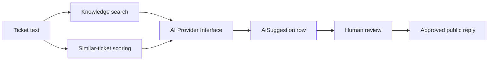

# AI Design

OpsPilot uses an AI provider abstraction:

The deterministic mock provider is used when `OPENAI_API_KEY` is not set. It uses transparent keyword rules so the VPN demo works immediately.

The OpenAI provider is optional. It sends a structured triage prompt and validates the JSON result with Zod before storing it.

AI responses include:

- Recommendation
- Confidence score
- Brief reasoning
- Source references when knowledge documents are used
- `mock` flag so the UI can label demo-generated suggestions

The current local retrieval implementation is keyword based. A future production version can replace it with vector search using `pgvector` while keeping the same retrieval interface.
