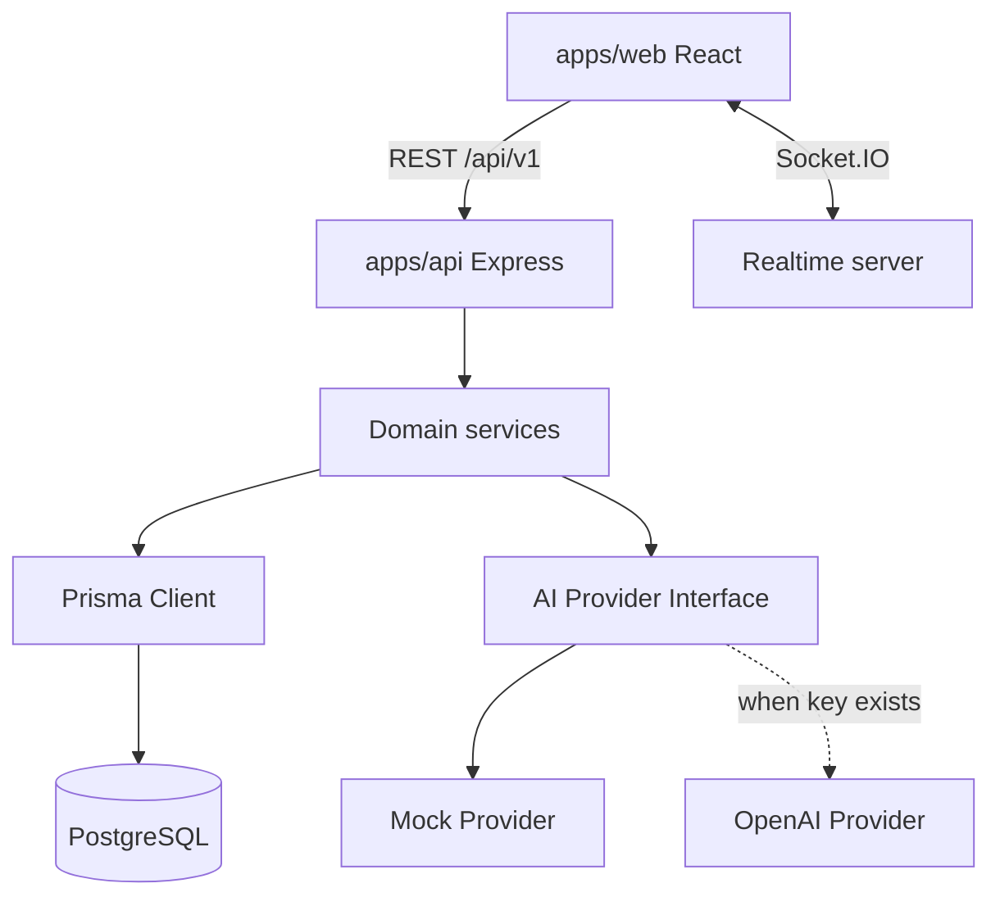

# Architecture

OpsPilot uses an npm workspace monorepo with a React frontend, Express API, shared validation/types package, and documentation.

The API keeps controllers thin. Route handlers validate input, call services, and return a consistent envelope. Services own workflow decisions such as ticket creation, status history, SLA deadlines, AI suggestion persistence, and audit events.

Tenant isolation is enforced by carrying `organizationId` from the access token into every organization-owned database query.
