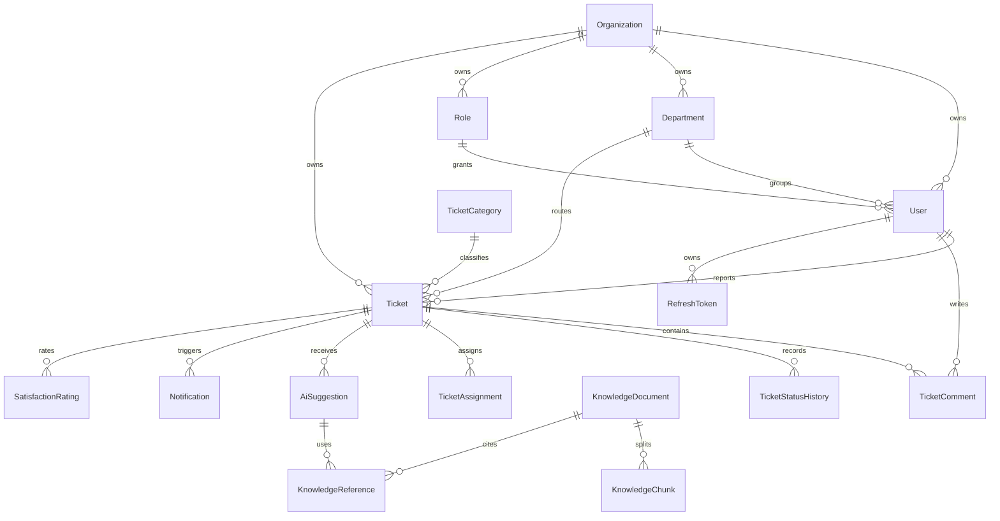

# Database

The database is normalized around organizations, users, support workflow entities, knowledge documents, AI suggestions, and audit history.



Every organization-owned table includes `organizationId`. Access-control tests should prove that a user from one organization cannot read or mutate records from another organization.

Schema commands:

```bash
npm run db:push -w apps/api
npm run db:seed -w apps/api
```
